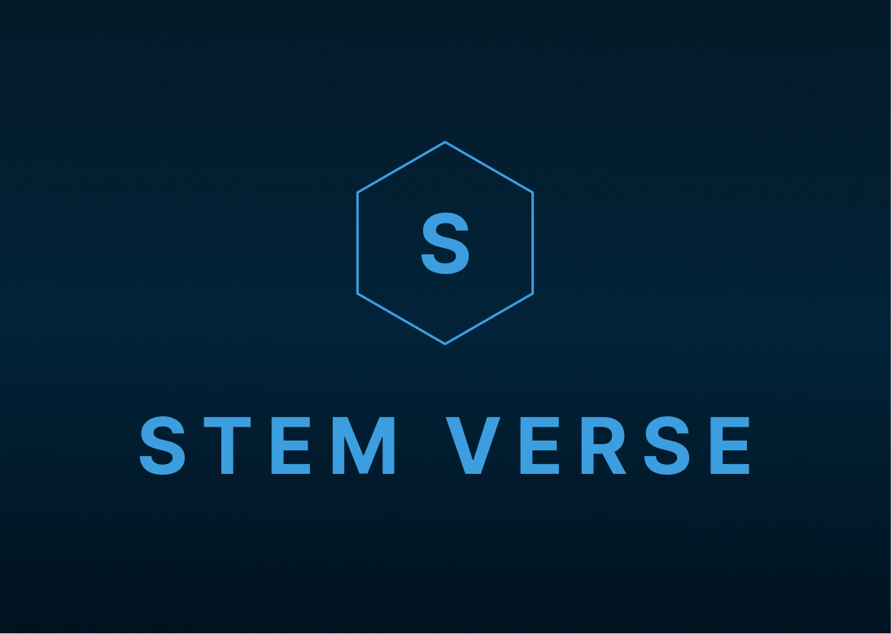

# Stemverse

Stemverse is a project of [@Mis311](https://github.com/Mis311/) and [@AcmeGamers](https://github.com/AcmeGamers/) for [Evmos Hackathon](https://devpost.com/software/stemverse). The purpose of the project was to create a decenteralized area for the STEM learners. 

## Getting Started

To get started with this project, there are few basic requirements that you would need to follow:

### Requirements

Before running this project, make sure you have the following things to get started.

- A System
- An Internet Connection
- [IDE](https://www.google.com/search?q=IDE+Examples&ei=YRVaYp65ObyM9u8P4tOpyAI&ved=0ahUKEwje7ZaGsZf3AhU8hv0HHeJpCikQ4dUDCA4&uact=5&oq=IDE+Examples&gs_lcp=Cgdnd3Mtd2l6EAMyBwgAEEcQsAMyBwgAEEcQsAMyBwgAEEcQsAMyBwgAEEcQsAMyBwgAEEcQsAMyBwgAEEcQsAMyBwgAEEcQsAMyBwgAEEcQsAMyBwgAELADEEMyBwgAELADEENKBAhBGABKBAhGGABQfFh8YKYDaAFwAXgAgAEAiAEAkgEAmAEAoAEByAEKwAEB&sclient=gws-wiz) for Editing the Code
- [Node JS](https://nodejs.org/en/download/)
- [Git](https://git-scm.com/downloads) (Optional)
- [Meta Mask](https://metamask.io/download/)

### Git Clone

Before starting the project, you need to either download or clone this project. To clone the project using [Git](https://git-scm.com/downloads), perform the following command in the bash terminal or in any other CLI.

```bash
git clone https://github.com/Mis311/STEMVERSE-Evmos-Momentum.git
```

### Changing Directory

After cloning and downloading the project, you need to move towards the Stemverse Evmos Project folder which contains the actual marketplace files. To do so, use the following command:

```bash
cd ./STEMVERSE-Evmos-Momentum/
```

### Installing Packages

Now you need to install the depedenecies for the project using the terminal.

```bash
# Step 1
npm install

# Step 2
cd smart_contracts
npm install

########
## or ##
########

# Step 1
yarn

# Step 2
cd smart_contracts
yarn


```

## Configuration

Since most of the configurations are already done, you might want to open a testnet for yourself. 

### MetaMask Testnet

The first step is to create a testnet on metamask. The process is quite simple:

- Open **MetaMask** > Login > Click on User Image
- Settings > Networks > **Add Network**

#### Network Information
- **Network Name:** ETH Testnet
- **New RPC URL:** HTTP://127.0.0.1:7545
- **Chain ID:** 1337
- **Currency Symbol:** ETH


### Hardhat Configuraiton

To do that, open a new terminal in the root directory **STEMVERSE-Evmos-Momentum**, and perform the following commands:

```bash
cd smart_contracts
npx hardhat node
```

### Metamask Configuration

Metamask configuration is just you importing accounts for testing purposes for minting and other solidity based functions. From the previous command `npx hardhat node`, you would have got around 20 accounts with their addresses and private keys. Follow the next steps:

- Open **MetaMask** > Login > Click on User Image
- Select **Import Account**
- Enter the private key of any account from hardhat configuration step

### Running Development Server

Once the dependencies are installed, you can run the development server using the command:

```bash
npm run dev
# or
yarn dev
```

Open [http://localhost:5173/](http://localhost:5173/) with your browser to see the results!

## Features

Here are some of the features of this NFT Marketplace:

- Mint NFTs
- - Make sure you are on a test environemnt like Ganache or it will cost you actual amount 😅
- Buy NFTs

## Upcoming Features

This a list of upcoming features that will be arriving soon.

## Dependencies

It uses the following dependencies to make the NFT Marketplace work:

- chai@^4.2.0
- ethers@^5.4.7
- hardhat@^2.11.1
- @nomiclabs (Below Only)
- - @nomiclabs/hardhat-waffle
- - @nomiclabs/hardhat-ethers
- web3
- @metamask/detect-provider
- react
- ethereum-waffle
- web3modal
- @openzeppelin/contracts
- ipfs-http-client
- axios

### More Dependencies

- @nomicfoundation (Below Only)
- - @nomicfoundation/hardhat-toolbox@^2.0.0
- - @nomicfoundation/hardhat-network-helpers@^1.0.0
- - @nomicfoundation/hardhat-chai-matchers@^1.0.0
- - @nomiclabs/hardhat-ethers@^2.0.0
- - @nomiclabs/hardhat-etherscan@^3.0.0

- hardhat-gas-reporter@^1.0.8
- solidity-coverage@^0.8.0
- @typechain/hardhat@^6.1.2
- typechain@^8.1.0
- @typechain/ethers-v5@^10.1.0
- @ethersproject/abi@^5.4.7
- @ethersproject/providers@^5.4.7

<!--
hardhat
@nomiclabs/hardhat-waffle
ethereum-waffle
chai
@nomiclabs/hardhat-ethers
ethers

hardhat@^2.11.1
@nomicfoundation/hardhat-toolbox@^2.0.0
@nomicfoundation/hardhat-network-helpers@^1.0.0
@nomicfoundation/hardhat-chai-matchers@^1.0.0
@nomiclabs/hardhat-ethers@^2.0.0
@nomiclabs/hardhat-etherscan@^3.0.0
chai@^4.2.0
ethers@^5.4.7
hardhat-gas-reporter@^1.0.8
solidity-coverage@^0.8.0
@typechain/hardhat@^6.1.2
typechain@^8.1.0
@typechain/ethers-v5@^10.1.0
@ethersproject/abi@^5.4.7
@ethersproject/providers@^5.4.7
-->

## Screen Sizing

- Created on 1366 x 768 Resolution

**Tested | Testing**

Tested on:

- 1366 x 768

Testing on:

- 1920 x 1080
